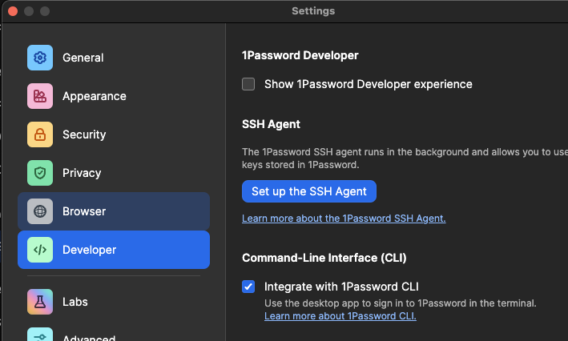

# macos-ansible
Setup MacOS with Ansible

## Setup 1Password Desktop app

Download and install [this](https://downloads.1password.com/mac/1Password.zip).

Sign in to the desktop app, enable CLI integration and SSH agent in the Developer settings.



## Run prepare scripts


## Run the playbook

```sh
sudo ansible-playbook local.yml
```